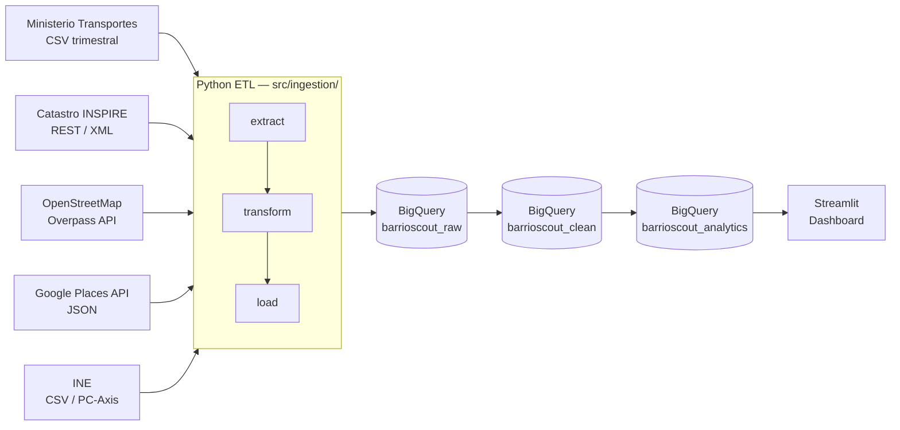

# BarrioScout 🏘️

> Real estate intelligence for Spanish neighbourhoods — Granada & Madrid


BarrioScout collects public real estate data, calculates location and price scores by neighbourhood,
and surfaces investment opportunities through an interactive dashboard.
Built entirely on GCP free-tier infrastructure as a portfolio data engineering project.

---

## Architecture



---

## Data Sources

| Source | Data | URL |
|--------|------|-----|
| [Ministerio de Transportes](https://www.mitma.gob.es/informacion-para-el-ciudadano/informacion-estadistica/vivienda-y-actuaciones-urbanas/estadisticas-y-publicaciones/precio-de-la-vivienda) | Quarterly transactions, price per m² | Public CSV |
| [Catastro INSPIRE](https://www.catastro.minhap.es/webinspire/index.html) | Building footprints, property attributes | REST API (XML) |
| [OpenStreetMap Overpass](https://overpass-api.de/) | POIs: schools, hospitals, supermarkets, metro, pharmacies | JSON |
| [Google Places API](https://developers.google.com/maps/documentation/places/web-service) | Service ratings & reviews | JSON (API key required) |
| [INE](https://www.ine.es/dyngs/INEbase/es/operacion.htm?c=Estadistica_C&cid=1254736177088&menu=ultiDatos&idp=1254734710990) | Median income, population by zone | CSV / PC-Axis |

---

## Project Structure

```
barrioscout/
├── config/settings.py        # Cities, coordinates, BQ config
├── src/
│   ├── ingestion/            # One module per data source
│   │   ├── ministerio.py
│   │   ├── catastro.py
│   │   ├── osm_pois.py
│   │   ├── google_places.py
│   │   └── ine.py
│   ├── processing/bq_loader.py   # Generic BigQuery loader
│   ├── scoring/              # Neighbourhood scoring logic
│   └── app/                  # Streamlit dashboard
├── sql/schemas/              # BigQuery DDL
├── tests/test_sources.py     # Source connectivity validation
├── notebooks/                # Exploratory analysis
└── data/raw/                 # Local samples for development
```

---

## Quick Start

```bash
# 1. Clone and install
git clone <repo-url> barrioscout
cd barrioscout
pip install -r requirements.txt
pip install -r dashboard/requirements.txt

# 2. Configure credentials
cp .env.example .env
# Set GOOGLE_PLACES_API_KEY in .env
gcloud auth application-default login   # for BigQuery access

# 3. Validate data sources (no BigQuery required)
python tests/test_sources.py

# 4. Launch dashboard
streamlit run dashboard/app.py
```

---

## Deployment (Streamlit Community Cloud)

The dashboard is deployed to [Streamlit Community Cloud](https://share.streamlit.io) (free tier).
BigQuery auth uses a dedicated read-only service account injected via Streamlit secrets.

### Create the service account (run once, do not execute automatically)

```bash
# Create SA with least-privilege BigQuery read access
gcloud iam service-accounts create streamlit-reader \
  --project=portfolio-alvartgil91 \
  --display-name="BarrioScout Streamlit Reader"

gcloud projects add-iam-policy-binding portfolio-alvartgil91 \
  --member="serviceAccount:streamlit-reader@portfolio-alvartgil91.iam.gserviceaccount.com" \
  --role="roles/bigquery.dataViewer"

gcloud projects add-iam-policy-binding portfolio-alvartgil91 \
  --member="serviceAccount:streamlit-reader@portfolio-alvartgil91.iam.gserviceaccount.com" \
  --role="roles/bigquery.jobUser"

# Export the key (store securely — never commit)
gcloud iam service-accounts keys create /tmp/streamlit-reader-key.json \
  --iam-account=streamlit-reader@portfolio-alvartgil91.iam.gserviceaccount.com
```

### Community Cloud setup steps

1. Go to [share.streamlit.io](https://share.streamlit.io) and sign in with GitHub
2. **New app** → connect repo `alvartgil91/barrioscout`
3. Set **Main file path**: `dashboard/app.py`
4. Open **Advanced settings → Secrets** and paste the contents of `/tmp/streamlit-reader-key.json`
   converted to TOML format (see `.streamlit/secrets.toml.example` for the exact structure)
5. Click **Deploy**

The app reads `st.secrets["gcp_service_account"]` in production; locally it falls back to
Application Default Credentials automatically — no code change required between environments.

---

## Roadmap

| Phase | Status | Description |
|-------|--------|-------------|
| **Phase 1** | ✅ Complete | Raw ingestion scripts (Ministerio, Catastro, OSM, INE) |
| **Phase 2** | ✅ Complete | Neighbourhood + district polygons (Madrid + Granada) |
| **Phase 3** | ✅ Complete | Scoring engine (Dataform, `agg_neighborhood_scores`) |
| **Phase 4** | ✅ Complete | Streamlit dashboard (map + ranking + detail panel) |
| **Phase 5** | ⏳ Planned | Automated weekly refresh, alerting on price anomalies |

---

## License

[MIT](LICENSE) © Alvaro
